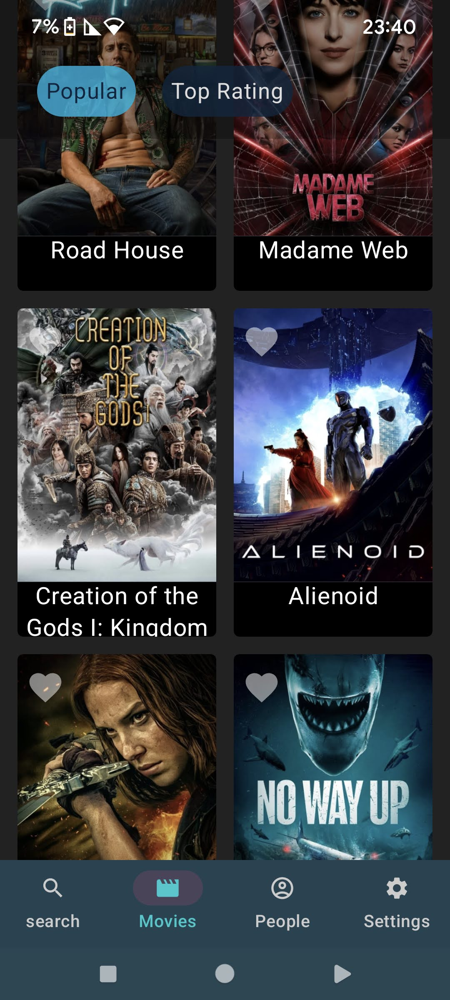
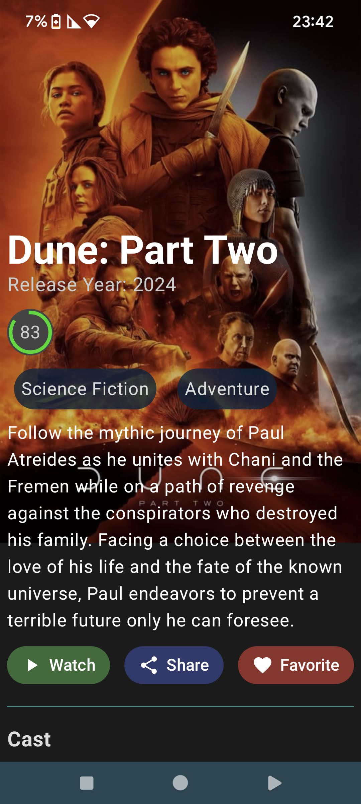
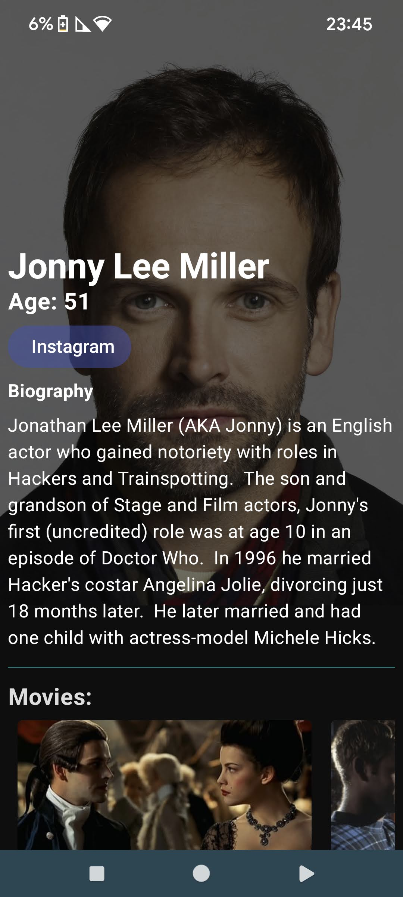

# TheMovieDbLab

Over the past year, as a Flutter developer, I've observed a shift towards Jetpack Compose as a standard in Android development. With Compose becoming a must-have skill recently, 
I felt compelled to dive back into Android development—a journey to relearning everything from scratch. Thus, I embarked on a project to build a new application beautiful.

TheMovieDbLab is the culmination of this journey, designed to interact with the TheMovieDb API for movie information.
Utilizing Ktor for network calls as separate notwork model, this project helped me brush up new Android development skills

This project is far from complete. There's much more to do, from enhancing error handlin, adding Paging 3 Library and cache for calls, and more features. 
My goal is to eventually publish this app on Google Play, but in the meantime, I'm inviting other developers to join this project. Let's learn and grow together.

### Tech Stack
- **Jetpack Compose:** Modern toolkit for building native UIs in Android, enabling us to write less code with a powerful and intuitive API.
- **Ktor:** A Kotlin-based asynchronous framework used for making network calls to TheMovieDb API. Chosen for its lightweight nature and seamless integration with Kotlin projects.
- **Kotlin Coroutines:** For managing background threads with simplified code and reducing the need for callbacks.
- **Android Architecture Components:** Including ViewModel, Flow.
- **Dagger-Hilt:** For dependency injection, making it easier to manage object lifecycles and dependencies.
- **Coil:** For efficient image loading and caching.

### Screenshots

  
  
   

